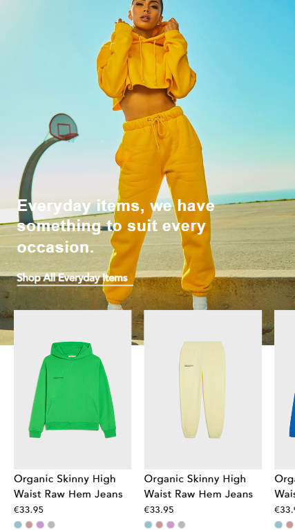

Modern ve sade kullanıcı arayüzüne sahip, mobil uyumlu bir Shopify temasıdır. Figma tasarımlarından yola çıkılarak kodlanmış, UI/UX prensiplerine uygun olarak geliştirilmiştir.

## 🔧 Kullanılan Teknolojiler / Technologies Used

- HTML5 & CSS3  
- Tailwind CSS
- Vanilla JavaScript (Saf JS)  
- Responsive Design  
- Figma (Tasarım Kaynağı)

## 🖼️ Screenshots

### 🖥️ Desktop View

### 📱 Mobile View

